# What is "model accuracy", really?

In the book [Responsible Machine Learning](https://www.h2o.ai/resources/ebook/responsible-machine-learning/),
when discussing trust and risk, the authors recommend a list of questions to ask to understand the
risk of a machine learning (ML) deployment.

One of the questions is **"What is the quality of the model? (Accuracy, AUC/ROC, F1)"**. These
metrics compare correct and incorrect predictions of a model.

But how exactly a model determines what a correct prediction is?

Here we will analyze the effect of an important factor a model uses to decide the correct
prediction (label) for classification problems, the **decision threshold**. We will see that
without understanding how a model decides what "correct" is, talking about the model accuracy
is premature.

We use _accuracy_ in this text as the number of correct predictions on the test set, divided by the
number of instances in the test set.

```text
             Number of correct predictions
accuracy = ----------------------------------
                  Number of instances
```

To illustrate the discussion, we will use an image classification model (the code is in this
[Jupyter notebook](./softmax-thresholds.ipynb)).

(_Simplification disclaimer: there are other types of problems, e.g. regression, and other types of
models -- we are making simplifications to expose the main concept._)

A typical image classification problem, taught early in machine learning, is digit classification with the
[MNIST dataset](http://yann.lecun.com/exdb/mnist/). The dataset looks like this (a small sample -
the dataset has 70,000 images):

&nbsp;&nbsp;&nbsp;&nbsp;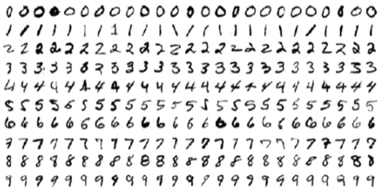

In an image classification problem, we train a model to identify an image's class (label).
In this case, there are ten classes, one for each digit (from zero to nine).

&nbsp;&nbsp;&nbsp;&nbsp;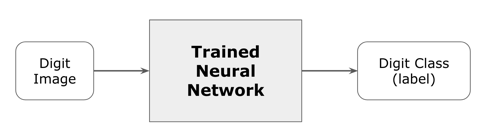

This is an actual digit from MNIST. The model correctly classifies it as the digit "2".

&nbsp;&nbsp;&nbsp;&nbsp;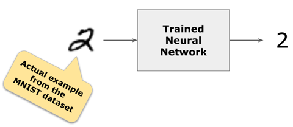

A neural network has several hidden layers to extract ("learn") features from the images. The very
last layer is the one that classifies the image. In this case, we are classifying ten classes (ten
digits). Therefore the last layer has ten neurons, one for each digit.

&nbsp;&nbsp;&nbsp;&nbsp;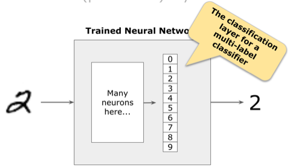

Because we want to know what digit it is, we use [softmax activation](https://www.tensorflow.org/api_docs/python/tf/keras/activations/softmax)
in the last layer to give us a probability distribution of each class. The model
is confident that the image is a number "2" in the case below.

&nbsp;&nbsp;&nbsp;&nbsp;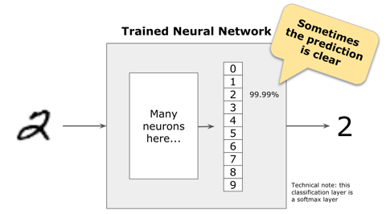

For other images, the model may not be so confident.

&nbsp;&nbsp;&nbsp;&nbsp;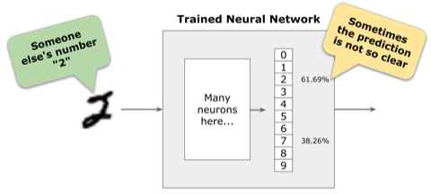

In those cases, how should we decide what the label is?

&nbsp;&nbsp;&nbsp;&nbsp;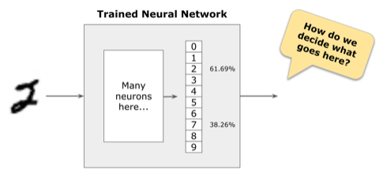

Most of the time, the class with the largest probability is used as the label. In this example, the
model classifies the image as the digit "2".

&nbsp;&nbsp;&nbsp;&nbsp;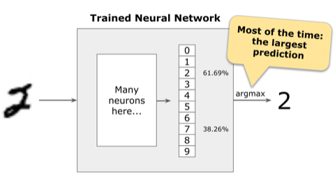

But what should the model do when the largest probability is not that high and is close to the
probability of other classes?

&nbsp;&nbsp;&nbsp;&nbsp;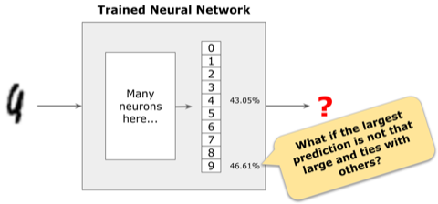

In the example below, the largest probability is for the class "9", but it is not even 50% and the
probability for class "4" is not too far behind. The model does not have high confidence in this
prediction.

&nbsp;&nbsp;&nbsp;&nbsp;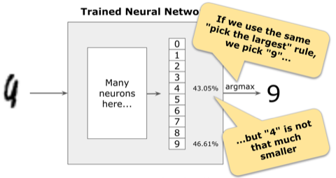

What should we do in these cases?

To solve those cases we usually pick a threshold for the decision. Instead of simply using the class
with the maximum probability, we select the largest probability above the threshold we chose. If we
choose 50% as the threshold, in the number "2" example above, we can still classify the image
as the number "2".

&nbsp;&nbsp;&nbsp;&nbsp;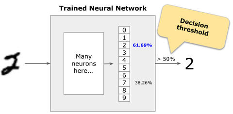

But now we no longer classify the ambiguous image as a number "9". In this case, we would not make
a decision at all.

&nbsp;&nbsp;&nbsp;&nbsp;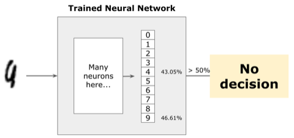

But what threshold do we pick?

It depends. For high-stakes applications, where wrong decisions have severe consequences, we want to
be very confident in the model's prediction.

For example, for an automatic check deposit application, we want the model to be at least 99%
confident of the prediction. Any image below that threshold is sent to human review.

&nbsp;&nbsp;&nbsp;&nbsp;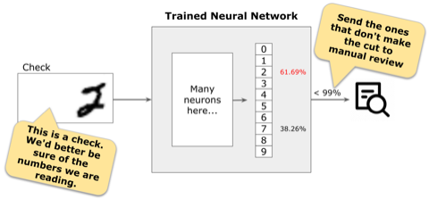

## Effect of different thresholds

The higher the threshold for the decision, the fewer images the model can classify. For the model used in these examples, this is the effect of different thresholds on the model's accuracy (the exact numbers may vary a bit from one run to another, but the relative differences will be about the same).

| Threshold | Accuracy |
| --------: | -------: |
|    99.99% |    48.7% |
|     99.9% |    75.6% |
|       99% |    90.0% |
|       90% |    96.4% |
|       80% |    97.8% |
|       75% |    97.8% |
|       67% |    98.2% |
|       50% |    98.8% |

## Asking questions about "accuracy"

The one-line takeaway: _to use a model responsibly **we must ask questions** about how its accuracy
was measured and not just accept published numbers_.

1. How predictions are being made: is it probability-based (as in the examples above)? Something
   else?
1. What factors control the predictions: is it threshold-based or some other decision (e.g. argmax)?
   If it is threshold-based, what are the thresholds?

_"We achieved 99.9% accuracy on [some task here]"_ means nothing if it's not accompanied by a
detailed description of what a "correct prediction" is for the model.

## ROC as a better alternative to accuracy

A better alternative to _accuracy_ is the [receiver operating characteristic (ROC) curve](https://en.wikipedia.org/wiki/Receiver_operating_characteristic) (for a simpler introduction, see [this page](https://developers.google.com/machine-learning/crash-course/classification/roc-and-auc)). The ROC curve shows, at a glance, how a model behaves with different thresholds.

Every scientific paper that describes a model should publish the ROC curve. Papers that publish only the accuracy for the model, and especially papers that publish the accuracy without specifying the threshold, are, at best, incomplete. At worst, they were written by uninformed machine learning novices.

## Video

A six-minute video version of this content is available [on YouTube](https://youtu.be/OI6DNLJxzTU).

## Running the example

If you want to try the example on your own:

1. Clone this repository
1. cd &lt;folder for the cloned repository&gt;
1. Create a [Python environment](https://docs.python.org/3/tutorial/venv.html): `python3 -m venv env`
1. Activate the environment: `source env/bin/activate` (Mac and Linux), or `env\Scripts\activate.bat` (Windows)
1. Upgrade pip (or TensorFlow installation may fail): `pip install --upgrade pip`
1. Install dependencies (only once): `pip install -r requirements.txt`
1. Run the notebook: `jupyter lab`
